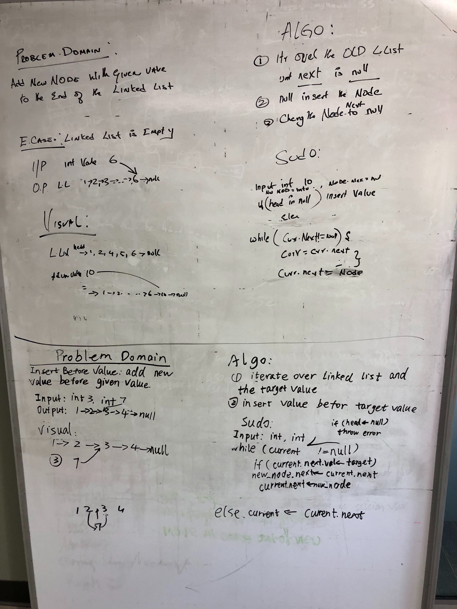
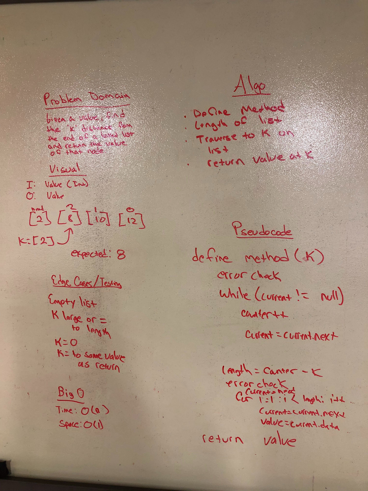
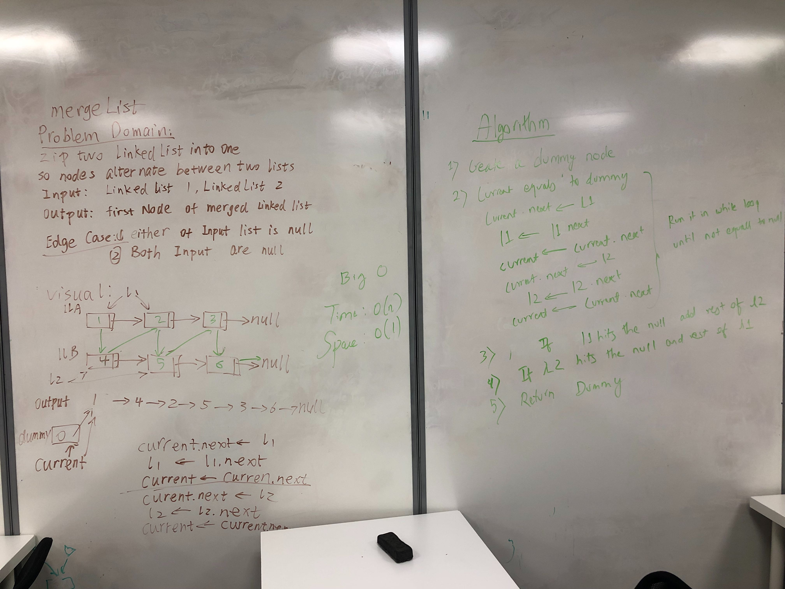
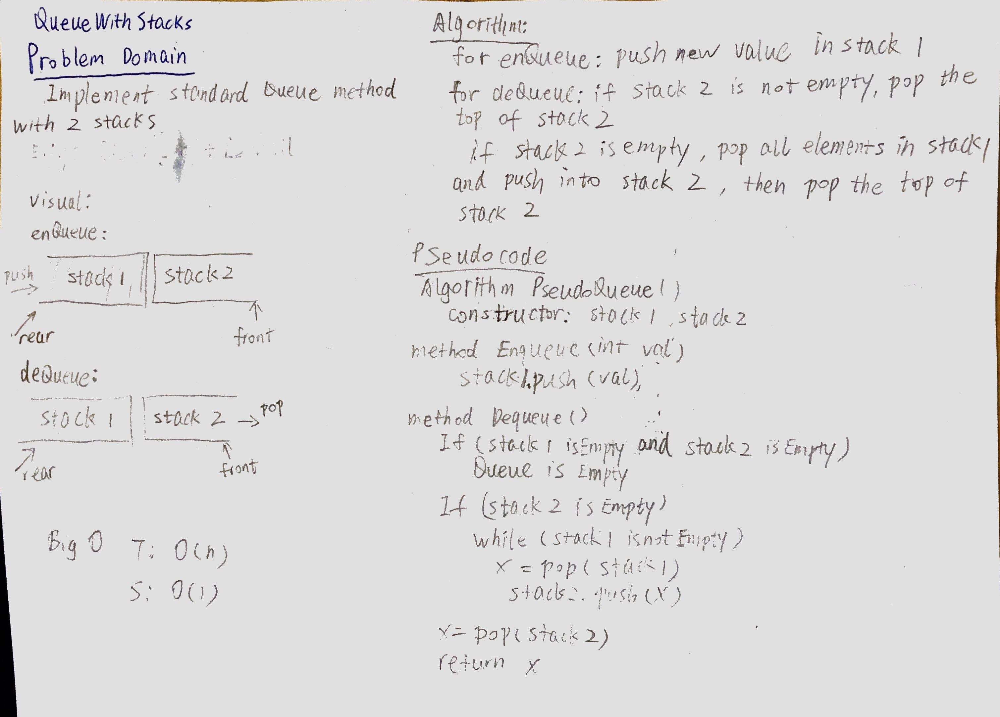
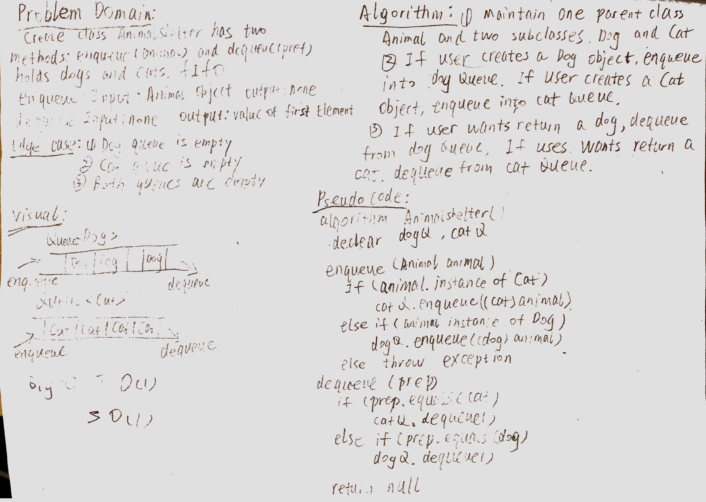
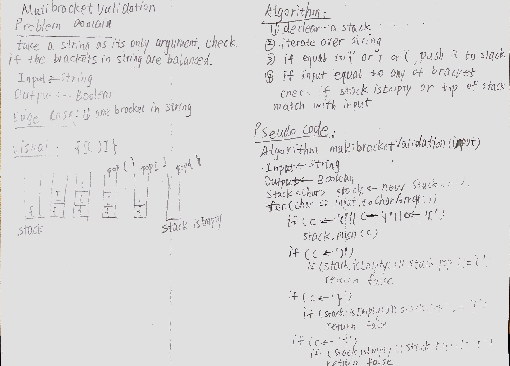
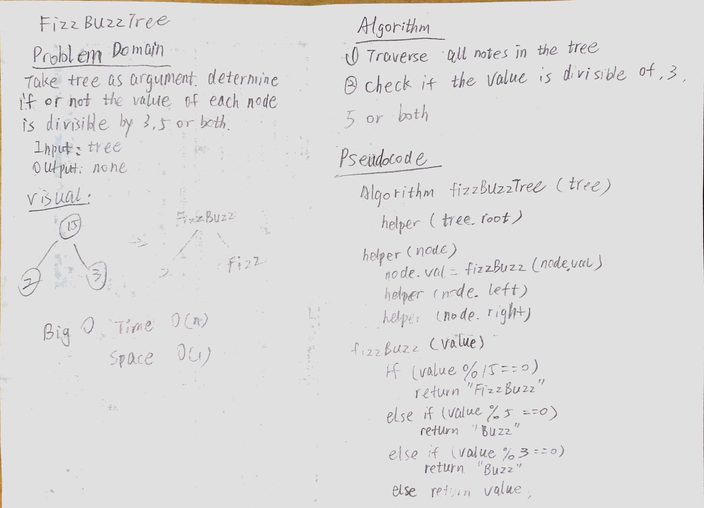
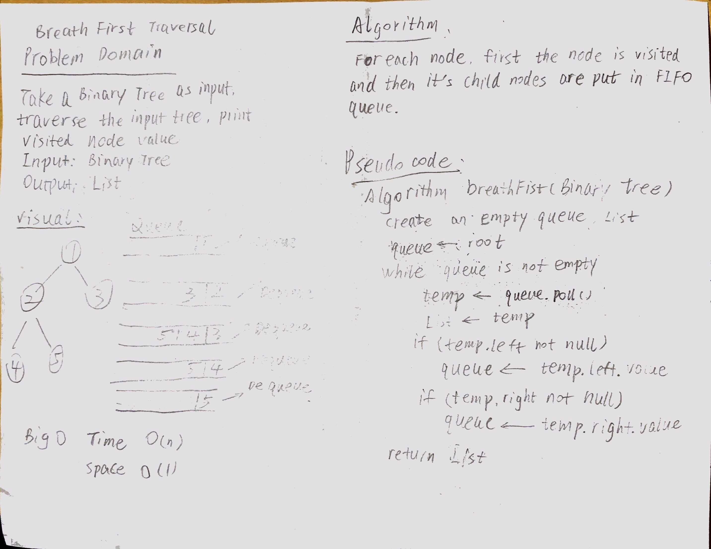

# Data Struture
<!-- Short summary or background information -->
Some methods for single linked list, stack, queue and tree.
## Challenge
<!-- Description of the challenge -->
1. Define a method called insert which takes any value as an argument and adds a new node with that value to the head of the list with an O(1) Time performance.
2. Define a method called includes which takes any value as an argument and returns a boolean result depending on whether that value exists as a Node’s value somewhere within the list.
3. Define a method called print which takes in no arguments and returns a collection all of the current Node values in the Linked List.
4. .append(value) which adds a new node with the given value to the end of the list
5. .insertBefore(value, newVal) which add a new node with the given newValue immediately before the first value node
6. .insertAfter(value, newVal) which add a new node with the given newValue immediately after the first value node
7. takes a number, k, as a parameter. Return the node’s value that is k from the end of the linked list.
8. merge two linked list
9. Stack: Define a method called push which takes any value as an argument and adds a new node with that value to the top of the stack with an O(1) Time performance.
10. Stack: Define a method called pop that does not take any argument, removes the node from the top of the stack, and returns the node’s value.
11. Stack: Define a method called peek that does not take an argument and returns the value of the node located on top of the stack, without removing it from the stack.
12. Queue: Define a method called enqueue which takes any value as an argument and adds a new node with that value to the back of the queue with an O(1) Time performance.
13. Queue: Define a method called dequeue that does not take any argument, removes the node from the front of the queue, and returns the node’s value.
14. Queue: Define a method called peek that does not take an argument and returns the value of the node located in the front of the queue, without removing it from the queue.
15. Queue with stacks:  implement our standard queue, but will internally only utilize 2 Stack objects.
16. fifoAnimalShelter: holds only dogs and cats. The shelter operates using a first-in, first-out approach.
17. MultiBracketValidation:  take a string as its only argument, and 
should return a boolean representing whether or not the brackets in the string are balanced.
18. Tree: 
- Create a Node class that has properties for the value stored in the node, the left child node, and the right child node.
- Create a BinaryTree class
  - Define a method for each of the depth first traversals called preOrder, inOrder, and postOrder which returns an array of the values, ordered appropriately.
  - Write a breadth first traversal method which takes a Binary Tree as its unique input. 
- Create a BinarySearchTree class
  - Define a method named add that accepts a value, and adds a new node with that value in the correct location in the binary search tree.
  - Define a method named contains that accepts a value, and returns a boolean indicating whether or not the value is in the tree at least once.

19. FizzBuzzTree: takes a tree as an argument.
- Without utilizing any of the built-in methods available to your language, determine weather or not the value of each node is divisible by 3, 5 or both, and change the value of each of the nodes:
  - If the value is divisible by 3, replace the value with “Fizz”
  - If the value is divisible by 5, replace the value with “Buzz”
  - If the value is divisible by 3 and 5, replace the value with “FizzBuzz”

## Approach & Efficiency
<!-- What approach did you take? Why? What is the Big O space/time for this approach? -->
1. insert: Big O time is O(1), space is O(1),
2. includes: Big O time is O(n), space is O(1),
3. print: Big O time is O(n), spce is O(n),
4. append: Big O time is O(n), space is O(1),
5. insertBefore: Big O time is O(n), space is O(1),
6. insertAfter: Big O time is O(n), space is O(1),
7. kthFromEnd: Big O time is O(n), space is O(1).
8. mergeLists: Big O time is O(n), space is O(1).
9. Stack.push(): Big O time is O(1), space is O(1). 
10. Stack.pop(): Big O time is O(1), space is O(1).
11. Stack.peek(): Big O time is O(1), space is O(1).
12. Queue.enqueue(): Big O time is O(1), space is O(1).
13. Queue.dequeue(): Big O time is O(1), space is O(1).
14. Queue.Peek(): Big O time is O(1), space is O(1).
15. PseudoQueue.enqueue(): 
- Approach: create two stack. push new value into stack 1.
- Big O time is O(1), space is O(1). 
16. PseudoQueue.dequeue():
- Approach: if stack 2 is not empty, then pop stack 2. If stack 2 is empty, pop all elements in stack 1 and push them into stack 2 then pop stack 2.
- Big O time is O(n), space is O(1).
17. AnimalShelter.enqueue(): 
- Approach: created a class that holds two queues one for cat and one 
for dogs. When I wanted to add a cat, it goes into the queue and dog likewise. The front of the queue should contain the longest animal in the shelter
- Big O time is O(1), space is O(1). 
18. AnimalShelter.dequeue(): 
- Approach: dequeue dog queue or cat queue according to user's input
- Big O time is O(1), space is O(1). 
19. MultiBracketValidation90: 
- Approach: create a stack to push open brackets into the stack, then 
if the corresponding closing bracket matches pop the open bracket off the stack. Then check if stack is empty return true otherwise false for unbalanced bracket string.
- Big O time is O(n), space is O(n).
20. Binary Tree:
- Approach: 
  - For preOrder print root value first, then use recursive to print left BinaryTree value, at last print right BinaryTree value.
  - For Breath First traversal: create an empty queue. loop while temp node is not null, add temp value into list and then enqueue temp's chileren, then dequeue the head of queue
For inOrder, print root value in second position. For postOrder, print root value in third position.
- For preorder, inorder and postorder Big O time is O(1), space is O(1). 
- For breath first Big O time is O(n), space is O(n)
21. Binary Search Tree:
- Approach: 
  - ADD() Compare the inserting element with root, if less than root, then recurse for left, else recurse for right. After reaching end,just insert that node at left(if less than current) else right.
  - Contains() search the root first, traverse the whole tree, if input value exsits return true, else return false.
- Big O time is O(n), space is O(n).

22. FizzBuzzTree: 
- Approach: traverse the whole binary tree and see if value is the factor of 15 or 5 or 3.
- Big O time is O(n), space is O(1).

## API
<!-- Description of each method publicly available to your Linked List -->
- insert, includes, print, append, insertBefore, insertAfter, kthFromEnd, mergeLists
[code](./src/main/java/Data/linkedList/LinkedList.java)

- Stack [code](./src/main/java/stacksandqueues/Stack.java)
- Queue [code](./src/main/java/stacksandqueues/Queue.java)
- PseudoQueue [code](./src/main/java/queueWithStacks/PseudoQueue.java)
- AnimalShelter [code](./src/main/java/fifoAnimalShelter/AnimalShelter.java)
- MultiBracketValidation [code](./src/main/java/multibracketvalidation/MultiBracketValidation.java)
- Binary Tree: printPreOrder, printInOrder, printPostOrder and printBreathFirst [code](./src/main/java/tree/BinaryTree.java)
- Binary search tree: add(), contains() [code](./src/main/java/tree/BinarySearchTree.java)
- FizzBuzzTree [code](./src/main/java/fizzBuzzTree/FizzBuzzTree.java)

## White Board

