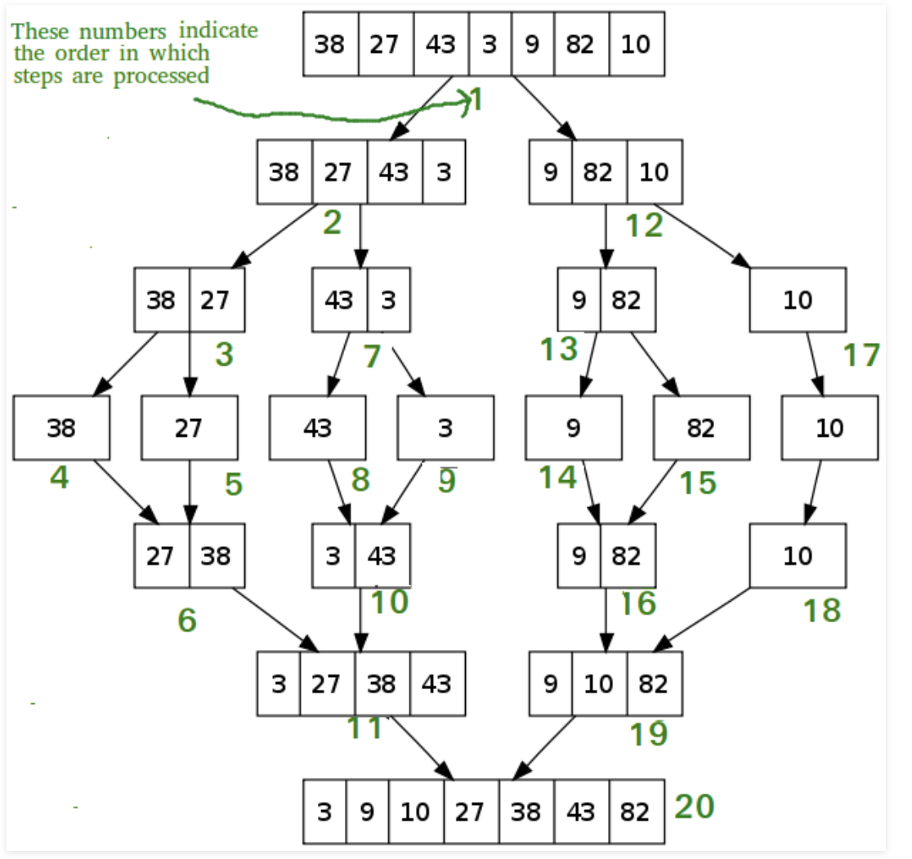

# Lecture Notes: Merge Sort
 Merge Sort is a Divide and Conquer algorithm. It divides input array in 
 two halves, calls itself for the two halves and then merges the two sorted halves.


## Learning Objectives
- you will learn how to sort a number array in ascending order by merge sort.

## Lecture Flow
- Draw a visual to show how this problem can be solved
- Choose the best solution you think and write down the algorithm.
- Start writing pseudocode
- How to test this code

## Diagram


## Algorithm
1. Find the middle point to divide the array into two halves:  
2. Call mergeSort for first half:   
3. Call mergeSort for second half:
4. Merge the two halves sorted in step 2 and 3

## Pseudo Code
```
ALGORITHM Mergesort(arr)
    DECLARE n <-- arr.length
           
    if arr.length > 1
      DECLARE mid <-- n/2
      DECLARE b <-- arr[0...mid]
      DECLARE c <-- arr[mid...n]
      // break down the left side
      Mergesort(b)
      // break down the right side
      Mergesort(c)
      // merge the left and the right side together
      Merge(b, c, arr)

ALGORITHM Merge(b, c, a)
    DECLARE i <-- 0
    DECLARE j <-- 0
    DECLARE k <-- 0

    while i < b && j < c
        if b[i] <= c[j]
            a[k] <-- b[i]
            i <-- i + 1
        else
            a[k] = c[j]
            j <-- j + 1
            
        k <-- k + 1

    if i = b.length
       add remaining items in array c to array a
    else
       add remaining items in array b to array a
       
    return a
```
## Readings and References

### Watch
- [Video](https://www.youtube.com/watch?v=TzeBrDU-JaY)

### Read
- [Insertion sort in GeeksforGeeks](https://www.geeksforgeeks.org/merge-sort/)
- [Insertion sort in baeldung](https://www.baeldung.com/java-merge-sort)