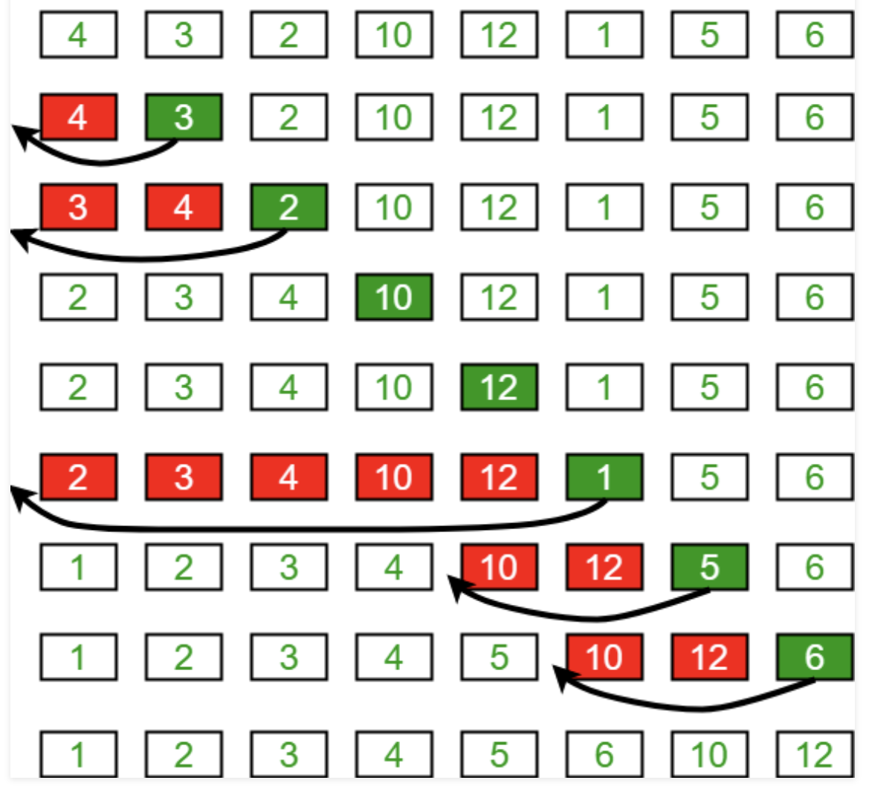

# Lecture Notes: Insertion  Sort
Insertion sort is a simple sorting algorithm that works the way we sort 
playing cards in our hands.

## Learning Objectives
- you will learn how to sort a number array in ascending order.

## Lecture Flow
- Draw a visual to show how this problem can be solved
- Choose the best solution you think and write down the algorithm.
- Start writing pseudocode
- How to test this code

## Diagram


## Algorithm
1. loop from i = 1 to n-1;
2. pick element arr[i] and insert it into sorted sequence of arr[0 ...i-1]

## Pseudo Code
```
 InsertionSort(int[] arr)
  
    FOR i = 1 to arr.length
    
      int j <-- i - 1
      int temp <-- arr[i]
      
      WHILE j >= 0 AND temp < arr[j]
        arr[j + 1] <-- arr[j]
        j <-- j - 1
        
      arr[j + 1] <-- temp
```
## Readings and References

### Watch
- [Video](https://www.youtube.com/watch?v=OGzPmgsI-pQ)

### Read
- [Insertion sort in wiki](https://en.wikipedia.org/wiki/Insertion_sort)
- [Insertion sort in tutorialspoint](https://www.hackerearth.com/practice/algorithms/sorting/insertion-sort/tutorial/https://www.hackerearth.com/practice/algorithms/sorting/insertion-sort/tutorial/https://www.hackerearth.com/practice/algorithms/sorting/insertion-sort/tutorial/https://www.hackerearth.com/practice/algorithms/sorting/insertion-sort/tutorial/)