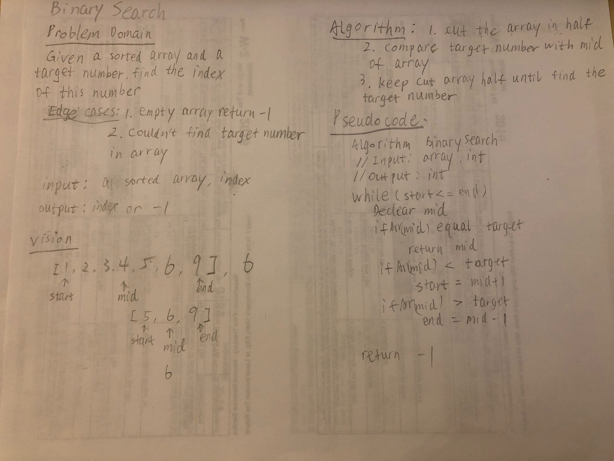

# Array binary search

## Challenge Description
<!-- Description of the challenge -->
take a sorted array and an key value. Find the index of where the key value is in the array.
## Approach & Efficiency
<!-- What approach did you take? Why? What is the Big O space/time for this approach? -->
Declare variables start and end to keep track of where you are in your array. Run a while loop for the array. Inside,
check three if statements: if val and key are equal, return the idx. If the key is less than the midVal, redeclare the
midVal and midIdx to the the value between the start and the former midValue. If the midVal is greater than the key,
redefine the midVal and the midIdx to the be at the place between the former midvalue and the end of the array. Repeat
this process. If the while loop ends the you still haven't foudn the key in the array, return -1.
## Solution
<!-- Embedded whiteboard image -->

[Code](../src/main/java/codechallenges/BinarySearch.java)
