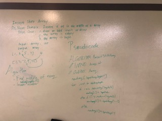

#Insert shift array

## Challenge Description
<!-- Description of the challenge -->
Work with a partner to whiteboard, code and test a task: take an array and an item,
insert the item into the middle of the array without using methods
## Approach & Efficiency
<!-- What approach did you take? Why? What is the Big O space/time for this approach? -->
Craete a new array, loop through the array, and assign values to the new array. For each loop, check if i is less than,
equal to, or greater than the length of the array divided by 2.Assing a new value to your new array, and then return
that new array.
## Solution
<!-- Embedded whiteboard image -->
[Code](../src/main/java/code/challenges/ArrayShift.java)
